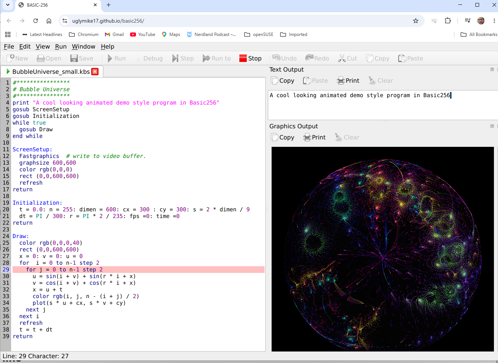
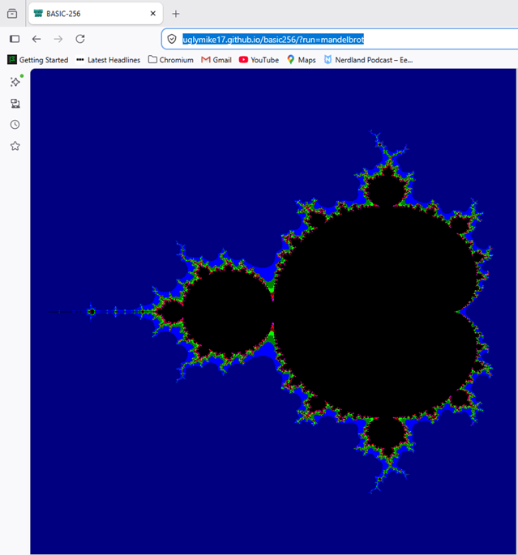
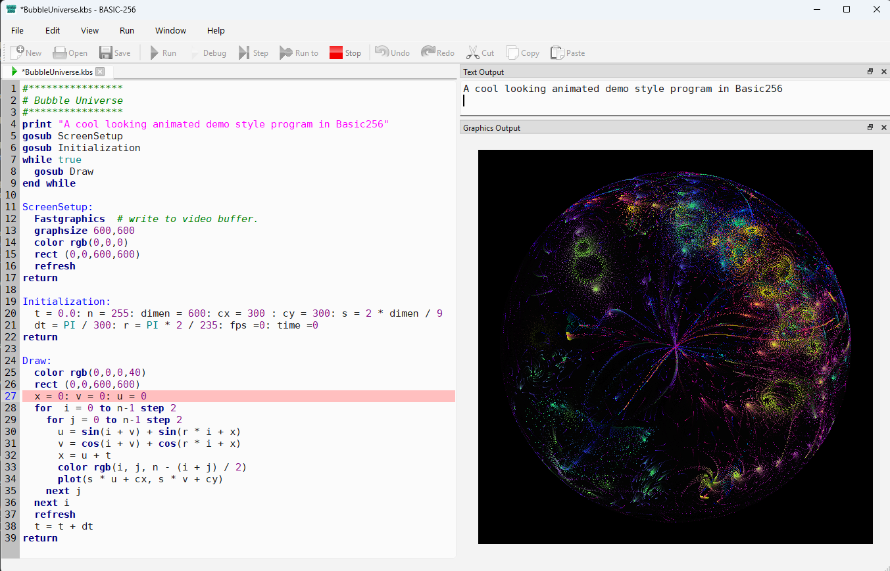
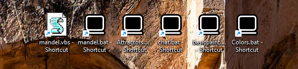

# BASIC256

<!-- Note: adjust the workflow filename in the CI badge below to match your actual workflow file in .github/workflows/ -->
[](https://github.com/uglymike17/basic256/actions)
[](https://github.com/uglymike17/basic256/releases)
[](license.txt)

> **The continuation of the classic BASIC-256 educational programming environment.**

BASIC256 is a simple, graphical dialect of BASIC designed for education. It enables beginners to learn programming through immediate visual feedback, graphics, sound and experimentation. This repository continues the original SourceForge project, modernizing the codebase (Qt6, CMake, CI, multi-platform) while preserving the spirit and compatibility of the original language.

## Try it in your browser

Thanks to Qt for WebAssembly, BASIC256 runs directly in your browser — the full
editor and interpreter, with no install needed.

**Live demo:** https://uglymike17.github.io/basic256/

### Running a program straight from the link

You can point the app at a program from the URL. **Which** program to run is one
parameter, and **how** to show it is another.

Three ways to name the program:

| parameter | where it looks | example |
|---|---|---|
| `?run=` | the **Example** programs built into the app | `?run=mandelbrot` |
| `?url=` | a file **on the site**, relative to the page | `?url=demos/bubble.kbs` |
| `?src=` | the program source itself, base64-encoded in the link | `?src=<base64>` |

`?run=` only sees the bundled Examples — dropping a `.kbs` onto your web server
does *not* make it visible to `?run=`; that's what `?url=` is for. `?url=` is
restricted to the site serving the page (a relative path), so a link can't point
the app at somebody else's server.

Then `&mode=` chooses the window layout. These mirror the command-line switches:

| `?mode=` | switch | |
|---|---|---|
| `ide` *(default)* | `-r` | full IDE, auto-run |
| `edit` | — | full IDE, loaded but **not** run |
| `graph` | `-g` | graphics only, auto-run |
| `text` | `-t` | text output only, auto-run |
| `app` | `-a` | text + graphics, no editor, auto-run |

So a plain link opens the IDE with the program loaded and running — you can see
it, stop it and edit it:

**https://uglymike17.github.io/basic256/?run=mandelbrot**



Add `&mode=graph` and you get just the canvas, with no menus or toolbars — the
form to use when embedding a demo in a page:

**https://uglymike17.github.io/basic256/?run=mandelbrot&mode=graph**



`mode` works with any of the three, so `?url=demos/bubble.kbs&mode=graph` runs
your own hosted program as a bare-canvas demo. On your own server, add folders
such as `/demos`, `/images` or `/sounds` and reference them from `?url=` or from
inside your programs.

### Hosting it yourself

Copy the WASM build to any static host served over **HTTPS**, and send these two
headers that the multithreaded build relies on:

```
Cross-Origin-Opener-Policy: same-origin
Cross-Origin-Embedder-Policy: require-corp
```

With those in place the page loads in a single pass — no reload — and the bundled
`coi-serviceworker` helper (only needed because GitHub Pages can't send those
headers itself) is no longer required.

### Good to know

Running inside a browser sandbox, a few things differ from the desktop version:

- **Files** live in an in-browser filesystem rather than on your disk; programs
  load and save through the browser.
- **Sound and `say`** use the browser's audio and speech support, and the first
  sound may need a click first (browsers block audio until you interact with the
  page).
- **Networking** (TCP sockets) isn't available in the browser.
- **Speed:** the browser build runs slower than the native one, so large fractals
  and particle simulations will run at a gentler pace.


## What the standard desktop app looks like

Started normally, BASIC256 opens a 3-pane IDE with edit, output and graphics windows:



A taste of the language:

```basic
# bubbles.kbs — random colorful circles
clg
fastgraphics
for i = 1 to 200
   color rgb(int(rand*256), int(rand*256), int(rand*256))
   circle rand*graphwidth, rand*graphheight, rand*40
   refresh
next i
```

For more advanced example programs than the ones included in the Examples directory (fractals, attractors, simulations and more), have a look at https://uglymike.static.domains or for older programs, do visit https://basic256.blogspot.com/.

## Download & install

Grab the latest build for your platform from the [Releases page](https://github.com/uglymike17/basic256/releases).

| Platform | Status | Notes |
| :--- | :---: | :--- |
| Windows (.zip) | ✅ | Extract anywhere you like. The full TestSuite runs without issue. |
| Windows (installer .exe) | ✅ | SmartScreen will initially block it as it comes from an unknown source — "More info" → "Run anyway" fixes this. A signed version might come later thanks to [SignPath's open-source program](https://signpath.io/solutions/open-source-community); this depends on GitHub stars and the success of the project. |
| Linux x86 (tarball / AppImage) | ✅ | Both are quite large as they include all prerequisite software. A .deb package (which would be much smaller, listing its prerequisites in metadata instead of bundling them) does not exist yet. |
| Raspberry Pi (tarball / AppImage) | ✅ | Same remark as Linux x86 regarding .deb. Speech does not work out of the box: Debian 13 ("Trixie") does not ship speech-dispatcher, so it must be installed manually. |
| macOS (Apple Silicon) | ⚠️ | Builds as a Homebrew-based app. Having no developer license, I can only apply ad-hoc signing — see below. |
| Web (WASM) | 🧪 v1 | Works, with a few known gaps — see below. |

### macOS notes

Ad-hoc signing should prevent the "basic256.app is damaged and can't be opened" message and show "unidentified developer" instead. If the "damaged" message still appears, strip the quarantine flag:

```console
xattr -cr /Applications/BASIC256.app
```

Another way to quickly run an ad-hoc signed Mac app is to open Terminal and apply the ad-hoc signature to bypass Gatekeeper:

```console
codesign --force --deep -s - /path/to/app.app
```

There is however a possibility to add your own Developer ID in the build script, opening a path to notarization, which would allow seamless installation on modern macOS versions.

### Browser build (WASM) limitations

The browser build is v1 and has a few known gaps compared to the desktop app:

- `SYSTEM`, serial port commands (`SERIALOPEN`...), `NETSERVER`/TCP server sockets, `DBOPEN`/SQL and `PRINTER...` are not available in a browser sandbox. Programs calling them get a clear "Feature not available on this platform" error and keep running — they don't crash or hang.
- Files a running program creates only live for the current browser session (no persistent storage yet).
- `NETREAD` (fetching a URL) is subject to the target site's CORS policy, same as any browser page.

## Command line / Terminal usage



BASIC256 can also be called from the command line with the following options:

| Short | Long | Effect |
| :---: | :--- | :--- |
| -? -h | --help | Display command-line help. |
| | --help-all | Display command-line help including Qt-specific options. |
| -v | --version | Display the BASIC-256 version. |
| -r | --run | Load and run the specified .kbs program. Must precede the filename. |
| -a | --app | Load and run the specified .kbs without the Edit window. |
| -g | --graph | Load and run the specified .kbs with only the Graphics window. |
| -t | --text | Load and run the specified .kbs with only the Text window. |
| -f | --full | When used with -r/-a/-t/-g, the full screen area will be used. |
| -s | --silent | Suppress all output. |
| -l | --lang --languageset | Start BASIC-256 using the specified language. |

The -a, -g and -t options allow you to run a program in kiosk mode, without showing the actual code window.
(Careful: if you set edit/graph/outputvisible flags inside your .kbs, these will override your CLI option.)

You can even make a desktop shortcut with a .bat file like:

```console
@echo off
C:\PATH_TO_BASIC256\basic256.exe -g Mandelbrot-256.kbs
```

to have a file run as if it were an application. Make sure to set the shortcut's "Run" property to Minimized to prevent a terminal window from popping up.

When writing a purely text-based adventure, you could create a batch file like:

```console
@echo off
C:\PATH_TO_BASIC256\basic256.exe -f -t Zork256.kbs
```

This way, there is no visible distraction from the text adventure.

A better option on Windows is to use a .vbs file instead:

```vb
' run_mandelbrot.vbs — no console window, ever
Set sh = CreateObject("WScript.Shell")
sh.Run """C:\PATH_TO_BASIC256\basic256.exe"" -g ""C:\PATH_TO_KBS\Mandelbrot-256.kbs""", 1, False
```

An example video of starting several graphics demos from Windows shortcuts can be seen here: https://www.youtube.com/watch?v=D8ord7K2QvI

## Building from source

Detailed compiling instructions can be found in [COMPILING.txt](COMPILING.txt).

For Raspberry Pi, there is a dedicated file: [COMPILING_RaspberryPI.txt](COMPILING_RaspberryPI.txt).

Highlights of the modernized build:

- CMake build system
- Microsoft Visual Studio 2022 support
- GitHub Actions CI
- Automated test suite
- Windows, Linux, Raspberry Pi and macOS builds
- WebAssembly (WASM) builds (v1)
- New command-line options for fullscreen mode, graphics only, text only and silent running

## History

### The original project

The original BASIC-256 v2.0.0.11 is a GPL-licensed, retro BASIC programming environment for learning coding and having fun. It was originally called KidBasic and was started in 2007 by Ian Larsen, later maintained by Jim Reneau and many contributors through the SourceForge project. After years of updates by the contributors and a rename to BASIC-256, it is in its current state still quite capable for everyday hobby use, but it is showing its age.

The original code and last downloadable version reside on [SourceForge](https://sourceforge.net/projects/kidbasic/) at version 2.0.0.11, released in 2020. It uses qmake and MinGW to compile the Windows version and is Qt5-based. It comes with an Examples directory, but most programs there need to be updated to modern specs related to speed and graphics sizes. There is also a TestSuite directory to test edge cases, but this doesn't run fully on 2.0.0.11.

Unfortunately, development of the SourceForge BASIC-256 apparently stopped after a failed attempt to port it to Qt6. Several development branches called 2.0.99.x were created between the last stable release and the moment it came to a standstill.

### This continuation

This GitHub repository ([uglymike17/basic256](https://github.com/uglymike17/basic256)) is my attempt to restart BASIC256. It takes the v2.0.99.10.2 branch as its starting point, with the aim of modernizing the codebase into a v2.1 — with a focus on portability, maintainability and education.

## Roadmap

Development continues with an emphasis on educational value while preserving compatibility.

### Editor

- Replace the editor with **QScintilla** for improved syntax highlighting and a better editing experience

### Language

- `ATAN2()` — a two-argument arctangent returns angle θ (in radians) between the positive x-axis and a ray pointing to the point (x, y) in the Cartesian plane. It correctly determines the angle across all four quadrants
- `FMOD()` —  This calculates the floating-point remainder of x/y, while MOD() is only for integers
- `SIMPLEX1D()` / `SIMPLEX2D()` — OpenSimplex noise, a spatially coherent noise generator (an evolution of Perlin noise): the backbone of natural-looking terrain, cloud textures, water ripples and wood grain in computer graphics
- `MAPWINDOW(xmin,xmax,ymin,ymax)` — coordinate mapping
- `CLAMP(value,min,max)` — value clamping, e.g. `red = CLAMP(red,0,255)`

Future additions will focus on mathematics, procedural graphics, simulations and classroom use.

## Vision

BASIC-256 should remain one of the easiest programming languages for beginners, while becoming one of the easiest educational environments to build, maintain and deploy on modern platforms — Windows, Linux, macOS and the Web.

## Contributing

Bug reports, feature requests, documentation improvements and pull requests are welcome.

## License

BASIC256 continues to be distributed under the GNU General Public License (GPL), the same open-source license as the original project. See the [license.txt](license.txt) file in the root directory for details.

## About the maintainer

I'm first and foremost a BASIC256 fan (see https://uglymike.static.domains/) rather than a professional developer. This project is maintained with the help of AI assistants (ChatGPT, Claude, Google's Gemini and Perplexity, all on free accounts) — proof of what the modern toolchain makes possible for a determined hobbyist. Contributions from people with more C++ and project-management experience are very welcome!
