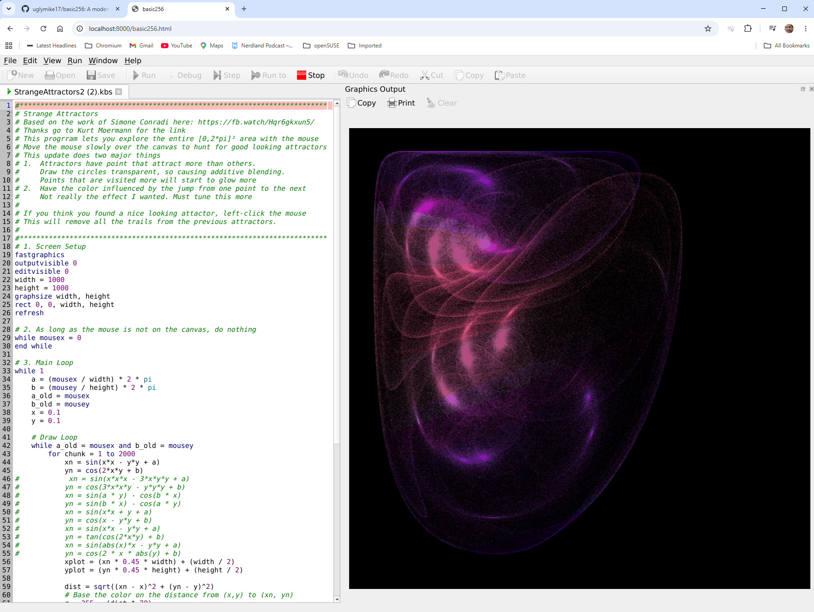

# Basic256

> **The continuation of the classic BASIC-256 educational programming environment.**

Basic256 is a simple, graphical dialect of BASIC designed for education. It enables beginners to learn programming through immediate visual feedback, graphics, sound and experimentation.

This repository continues the original SourceForge project by modernizing the codebase while preserving the spirit and compatibility of the original language.


## Original Project 
The original BASIC-256 v2.0.0.11 is a GPL-licensed, retro BASIC programming environment for learning coding and having fun. 
It was originally called Kidbasic and was started in 2007 by Ian Larsen and later maintained by Jim Reneau and many contributors through the SourceForge project. After years of updating by the contributors and a rename to BASIC-256, it is in its current state still quite capable for everyday hobby use but is showing its age.  
The original code and last downloadable version resides on SourceForge (https://sourceforge.net/projects/kidbasic/) and is at version 2.0.0.11, which launched in 2020. It uses qmake and MinGW to compile the Windows version. It is a Qt5-based software.
 It comes with an Example directory but most programs there need to be updated to modern specs related to speed and graphics sizes. For more 'advanced' code than the included Example programs, I invite you to go look at https://uglymike.static.domains. There is also a Testsuite directory to test edge cases but this doesn't run fully on 2.0.0.11. 

Unfortunately, development of the SourceForge Basic256 has apparently been stopped  after a failed attempt to port it to Qt6. Several development branches called 2.0.99.x have been created between the last stable release and the moment it came to a standstill.

## About this continuation of the original BASIC-256 project.  
This new GitHub repository (GitHub - uglymike17/basic256) is my attempt to restart Basic256 and takes the v2.0.99.10.2 branch with the aim of trying to modernize the codebase into a v2.1.

This repository modernizes BASIC-256 with a focus on portability, maintainability and education.

## Highlights

- CMake build system
- Microsoft Visual Studio 2022 support
- GitHub Actions CI
- Automated test suite
- Windows builds
- Linux builds
- macOS builds
- WebAssembly (WASM) builds (v1, in progress) 
- New command-line options for fullscreen mode, graphics only, text only and silent running


---


## Desktop Usage  
This now Qt6-based C++ program, when started simply with the basic256.exe command (or by clicking on its icon), opens with a 3-pane IDE with edit-, output- and graphics-windows. 


## Browser Usage (WebAssembly)  
Thanks to Qt-for-WebAssembly, Basic256 also runs directly in the browser, no install needed. Once GitHub Pages is switched on for this repo, the live build will be at:

https://uglymike17.github.io/basic256/

(First load triggers one automatic page reload — that's a small helper script setting up the cross-origin isolation headers GitHub Pages can't send directly, needed for the multithreaded WASM build.)


The browser build is v1 and has a few known gaps compared to the desktop app:
 - `SYSTEM`, serial port commands (`SERIALOPEN`...), `NETSERVER`/TCP server sockets, `DBOPEN`/SQL, `PRINTER...`, and `SAY` (text-to-speech) are not available in a browser sandbox — programs calling them get a clear "Feature not available on this platform" error and keep running, they don't crash or hang.
 - Sound loaded via `SOUNDLOAD` (arbitrary audio files) doesn't play yet; BEEP/waveform sound (`SOUND freq,duration`) does.
 - There's no real file-open/file-save dialog for BASIC's own file commands — use your browser's own download/upload prompts for loading and saving `.kbs` programs instead.
 - Files a running program creates only live for the current browser session (no persistent storage yet).
 - `NETREAD` (fetching a URL) is subject to the target site's CORS policy, same as any browser page.

## Usage from the command line/Terminal  


Basic256 however can also be called from the command-line/Terminal with the following options:

| Short | Long  | #Effect    |
| :---: | :---: | :---: |
|-? -h|--help|Display command-line help.|  
||--help-all|Display command-line help including Qt-specific options.|  
|-v|--version|Display the BASIC-256 version.|
|-r|--run|Load and run the specified .kbs program. Must precede the filename.|
|-a|--app|Load and run specified .kbs without Edit window | 
|-g|--graph|Load and run specified .kbs with only Graphics window | 
|-t|--text|Load and run specified .kbs with only Text window |
|-f|--full|When used with -r/ -a/ -t/ -g, the full screen area will be used.|
|-s|--silent|When used this will suppress all output.|
|-l|--lang --languageset|Start BASIC-256 using the specified language.|

The -a, -g, -t options allow you to run the program in kiosk mode, without showing the actual code window.  
(Careful: if you add edit/graph/outputvisible flags in your .kbs, these will override your CLI option)

One can even make a shortcut on the desktop with a .bat file like:
 ```console
@echo off
C:\PATH_TO_BASIC256\basic256.exe -g Mandelbrot-256.kbs
 ```
to have a file run as if it was an application.  
Make sure to set the "Run" property to Minimized to prevent a terminal window from popping up.  
When writing a purely text-based adventure, you could create a batch file like:
 ```console
@echo off
C:\PATH_TO_BASIC256\basic256.exe -f -t Zork256.kbs
 ```
 This way, there is no visible distraction from the text adventure.  

 Maybe a better way in Windows to use a .vbs file instead of a:
 ```console
' run_mandelbrot.vbs  — no console window, ever
Set sh = CreateObject("WScript.Shell")
sh.Run """C:\PATH_TO_BASIC256\basic256.exe"" -g ""C:\PATH_TO_KBS\Mandelbrot-256.kbs""", 1, False
 ```
An example video of starting several graphics demos from windows shortcuts can be seen here: https://www.youtube.com/watch?v=D8ord7K2QvI


 ## Current status as of 2026-07-08
 
 1. Windows .zip file is working and can be extracted anywhere you like. The full TestSuite runs without issue.
 2. Windows installer .exe file is working. Running it however will trigger Smartscreen as it comes from an unknown source so Smartscreen will initially block it. More info/Run anyway will fix this. A signed version might come later thanks to https://signpath.io/solutions/open-source-community. This however depends on GitHub stars and success of the project.
 3. Linux x86 tarball and AppImage are working. Both however are very large as they include all prerequisite software. A Linux .deb package file will explicitly list its prerequisite software in its metadata so a .deb package is a lot smaller. No .deb exists as yet.
 4. Raspberry Pi tarball and AppImage seem to be working. Here we have the same remark as for Linux-x86 regarding .deb.
 Speech does not work out-of-the-box since Trixie does not come with speech-dispatcher so this MUST be installed. 
 5. Building for macOS Silicon (M1, M2, M3) resulted in a Homebrew basic256 app, but having no developer license, I can only add an ad-hoc signing. This should prevent message: "basic256.app is damaged and can't be opened" and should show messge "unidentified developer" instead. If this happens, try the command to strip the quarantine flag:
    ```console
    xattr -cr /Applications/BASIC256.app
    ```

    Another way to quickly run an ad-hoc signed Mac app is to open Terminal, apply the ad-hoc signature to bypass the Gatekeeper with 
    ```console
    codesign --force --deep -s - /path/to/app.app
    ```
     There is however a possibility to add your own Developer ID in the script and so to open a path to notarization which would allow seamless installation on modern macOS versions.
  

## Building from Source

Detailed instructions on compiling can be found in the file COMPILING.txt

For Raspberry Pi, there is a dedicated file COMPILING_RaspberryPI.txt

---
## Roadmap

Development continues with an emphasis on educational value while preserving compatibility.

## Editor

- Replace the editor with **QScintilla**
- Improved syntax highlighting
- Better editing experience

## Language

Existing now:  
Basic256 already has the following function

- `RAND()`

If you generate a number between 0 and 100, getting a 5 is just as likely as getting a 50 or a 99.
Each time you call RAND(), the result is completely independent of the last call.  
New functions:  
We will expand RAND() with

- `GAUSSIAN()`

This also generates independent random numbers, but they are weighted toward a central average leading to the typical bell curve.  
Next will come 

- `SIMPLEX1D()`
- `SIMPLEX2D()`

OpenSimplex noise is an evolution of Perlin Noise which does not just spit out an independent number but is a spatially coherent noise generator. 
It is the backbone of generating natural-looking terrain (hills rolling into valleys), cloud textures, water ripples, and wood grain in computer graphics.

Coordinate mapping:

```basic
MAPWINDOW(xmin,xmax,ymin,ymax)
```

Value clamping:

```basic
red = CLAMP(red,0,255)
```

Future additions will focus on mathematics, procedural graphics, simulations and classroom use.

---

## Vision

BASIC-256 should remain one of the easiest programming languages for beginners while becoming one of the easiest educational environments to build, maintain and deploy on modern platforms, including Windows, Linux, macOS and the Web.

---

## Contributing

Bug reports, feature requests, documentation improvements and pull requests are welcome.

---

## License

BASIC-256 continues to be distributed under its original open-source license. See the license.txt file in the root directory for details.

## Remark  
I'm mainly a Basic256 fan (see https://uglymike.static.domains/) and have practically no knowledge of github, c++ or 'real' programming and project management. I'm using free accounts on chatGPT, Claude, Google's Gemini and Perplexity to get where I am now.  