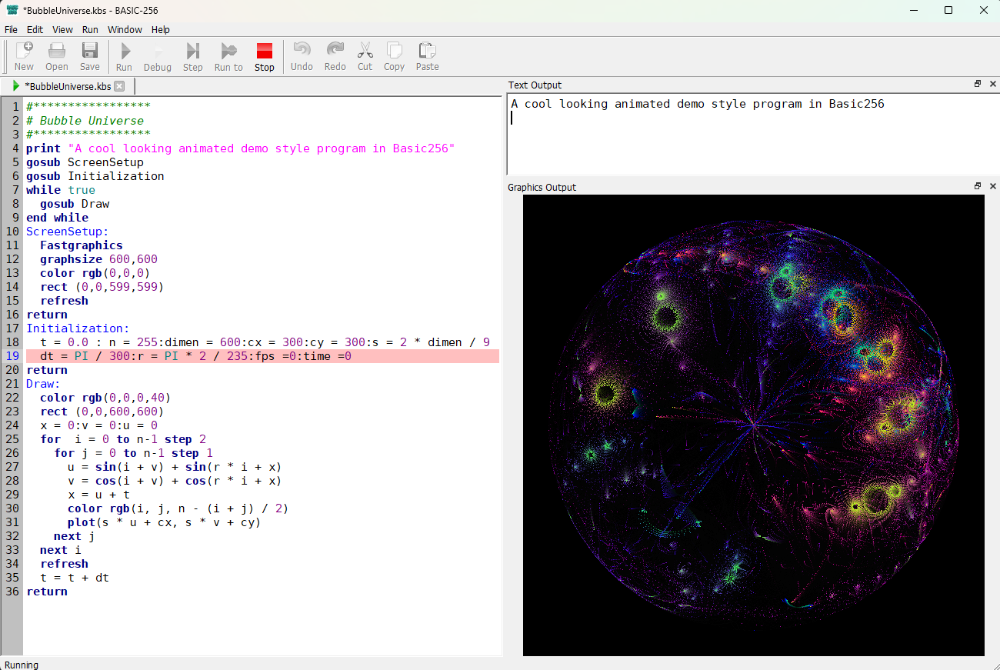

**Introduction**  
*****************
BASIC-256 is modern retro BASIC programming environment for learning coding and having fun. 
It was originally called Kidbasic and was started in 2007, but after years of updating by the original contributers and a rename to Basic256, it is in its current state quite capable for everyday hobby use .

**Usage**  
*****************
This Qt5-based C++ program, when started simply with the basic256.exe command (or by clicking on its icon), opens with a 3-pane IDE with edit-, output- and graphics-windows. 


Basic256 however can also be called from the command-line/Terminal with the following options:

| Short | Long  | #2    |
| :---: | :---: | :---: |
|-? -h|--help|Display command-line help.|  
||--help-all|Display command-line help including Qt-specific options.|  
|-v|--version|Display the BASIC-256 version.|
|-r|--run|Load and immediately run the specified .kbs program. Must precede the filename.|
|-a|--app|Run specified .kbs without Edit window | 
|-g|--graph|Run specified .kbs with only Graphics window | 
|-t|--text|Run specified .kbs with only Text window |
|-f|--full|When used with -r/ -a/ -t/ -g, the full screen area will be used.|
|-l|--lang --languageset|Start BASIC-256 using the specified language.|

The -a, -g, -t options allow you to run the program in kiosk mode, without showing the actual code window.  
(Carefull: if you add  edit/graph/outputvisible flags in your .kbs, these will override you CLI option)

One can even make shortcut on the desktop with a .bat file like:
 ```console
@echo off
C:\PATH_TO_BASIC256\basic256.exe -g Mandelbrot-256.kbs
 ```
to have a file run as if it was an application.  
Make sure to set the "Run" property to Minimized to prevent a terminal window from popping up.  
When writing a purely text-based adventure, you could create a batch file like:
 ```console
@echo off
C:\PATH_TO_BASIC256\basic256.exe -f -t Zork256.kbs
 ```
 This way, there is no visible distraction from the text adventure.  

 Maybe a better way in Windows to use a .vbs file instead of a:
 ```console
' run_mandelbrot.vbs  — no console window, ever
Set sh = CreateObject("WScript.Shell")
sh.Run """C:\PATH_TO_BASIC256\basic256.exe"" -g ""C:\PATH_TO_KBS\Mandelbrot-256.kbs""", 1, False
 ```

**Original Project**  
***************************
The original code and last downloadable version resides on SourceForge (https://sourceforge.net/projects/kidbasic/) and is at version 2.0.0.11, which launched in 2020. It uses qmake and MinGW to compile the Windows version. It had a Mac version (Intel Macs) but has been discontinued since long. 
 It comes with an Example directory but most programs there need to be updated to modern specs related to speed and graphics sizes. There is also a Testsuite directory but this does not come with the Installer. For more 'advanced' code than the included Example programs, I invite you to go look at https://uglymike.static.domains

Unfortunately, development of Basic256 has apparently been stopped  after a failed attempt to port it to Qt6.

**About this fork**  
*************************
This new  GitHub repository (Github - uglymike17/basic256) is my attempt to restart Basic256 and takes the v2.0.99.10.2 the branch with the aim of trying to modernize the codebase into a v2.1.

The initial aim for this branch is to provide a modern toolchain and stabilisation
 
 - port from qmake to CMake and from minGW to MSVC  
   ==> Seems to have gone ok, although some issues cropped up. (eg: A DIM statement should now always add 'fill 0' to prevent issues)
 - make clean-ups & modernisations where possible.  
   ==> fix some leaks  
   ==> removed depreciated Qt operands.  
   ==> Add -g /--graph and -t /--text CLI options.  
   ==> Remove some unused code.

 - make it compile on Windows, Linux-x86 and Linux-ARM (RPi) and MacOS Silicon.  
   ==> All architecture build ok but need more testing.

 **Current status as of 27/06/2026**
 ********************************
 There is a single build.yml file that builds and packages all architectures via scripts. At the moment I produce an install .exe for Windows (nsi based) and a standalone Windows .zip file, a tarball and an AppImage for Linux-x86 and a tarball and and an AppImage  for Linux-ARM and a zip file for MacOS.
 1. Windows .zip file seems to be working and can be extracted anywhere you like. (more testing required)
 2. Windows installer .exe file seems to be working although coming from an unknown source. (more testing required) A signed version mght be coming thanks to https://signpath.io/solutions/open-source-community 
 2. Linux x86 tarball and AppImage seem to be working. Tarball however is very large. (more testing required)
 3. Raspberry Pi tarball is problematic on Trixie. Github runner Ubuntu-24.4-ARM has a different Qt5 than Trixie. These do not mix and as Trixie does not include several required Qt5 libraries, I have to bundle all the runner's Qt5 libs. AppImage is a lot smaller. In any case, speech does not work out-of-the-box since Trixie does not come with speech-dispatcher so this MUST be installed. 
 4. MacOS Silicon (M1,M2,M3) resulted in an Homebrew basic256 app, but having no developer license, I added an ad-hoc signing. This should prevent the message: "basic256.app" is damaged and can't be opened. This should show the messge "unidentified developer" instead. If this happens, try the command to strip the quarantine flag:
    ```console
    xattr -cr /Applications/BASIC256.app
    ```

    According to Google AI, the following should work as well:  
    To quickly run an ad-hoc signed Mac app, open Terminal, apply the ad-hoc signature to bypass the Gatekeeper with 
    ```console
    codesign --force --deep -s - /path/to/app.app
    ```
     There is however a possibility to add your own Developer ID in the script and so to open a path to notarisation which would allow installation seemlessly on modern MacOS versions.
 
Future actions
**************************
First thing on the agenda is to get the word out so anybody could give their feedback on it. 
Linux Distro's provide their own 'old' Basic256 package, so contacting the maintainers would only become required after major improvements to the code. For this, AppImage files are being prepared

Once this main branch is stable enough, I (we?) can start adding small features like new functions or commands  (ATAN2, Perlin Noise, Clamp,...). A big whishlist item would be to switch to the qscintilla editor, but this is not urgent.
Ideally there should later be an uncoupling of interpreter code, GUI code, CLI code (?) etc in order to be able to compile it into WebAssembly. (one can dream...). Finally, a Qt6 migration is long overdue

Also, example files should be updated to reflect more modern machines.   
The wiki-based help at doc.basic256.org should be updated and a renewed website would be required. Unfortunately, neither of these last two is under my control but I am in contact with the main maintainer of the project...

**Remark**  
**********************
I'm mainly a Basic256 fan (see https://uglymike.static.domains/) and have practically no knowledge of github, c++ or 'real' programming and project managment. I'm using free accounts on chatGPT, Claude, Google's Gemini and Perplexity to get where I am now.  

Some help from more 'experienced' programmers would be very welcome.