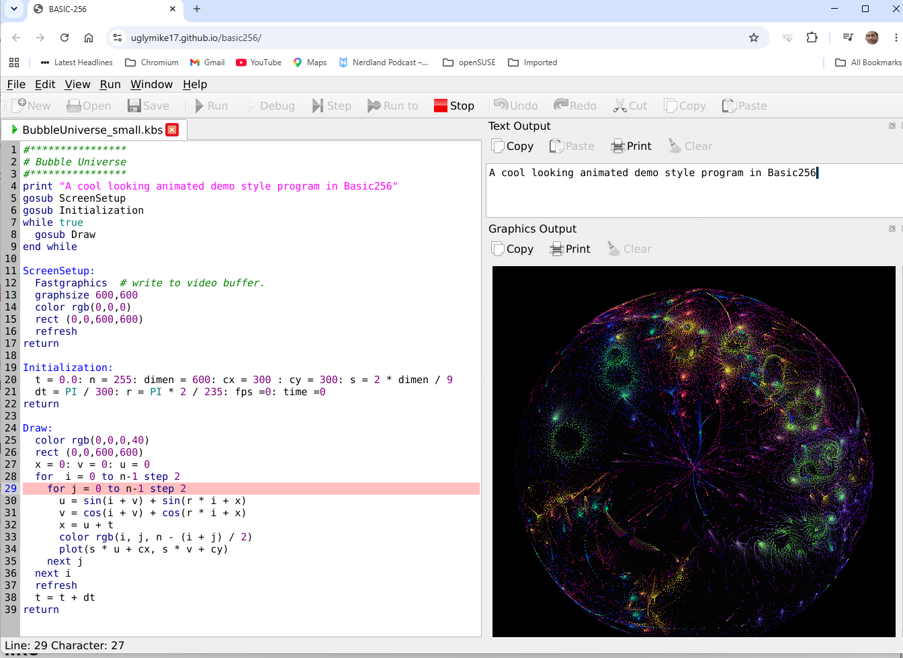
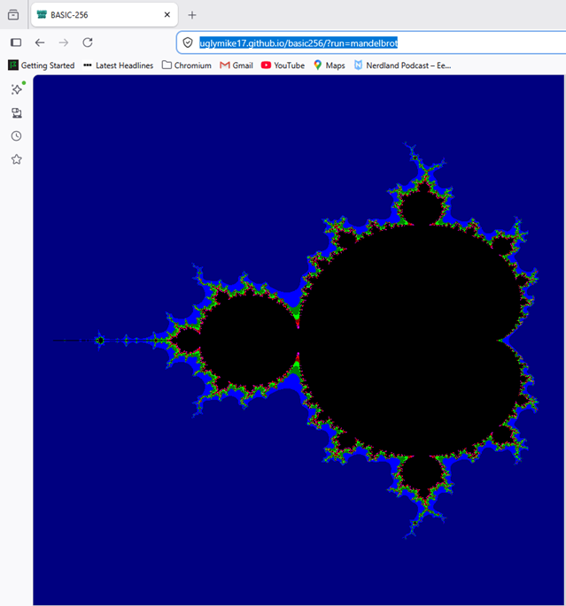
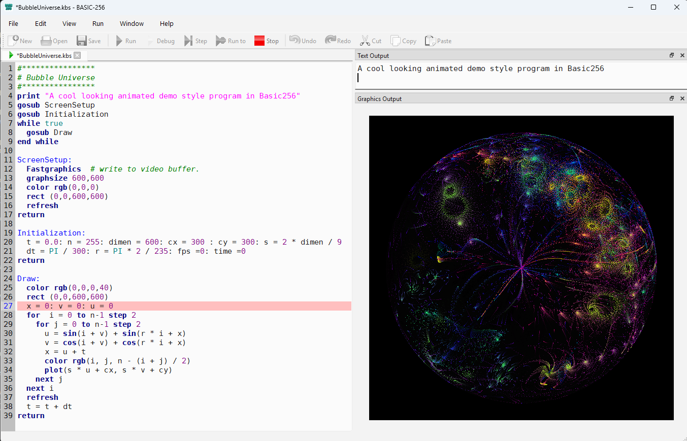
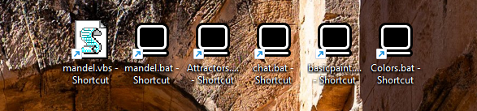

# BASIC256

[](https://github.com/uglymike17/basic256/actions)
[](https://github.com/uglymike17/basic256/releases)
[](license.txt)

> **BASIC256 is a classic BASIC programming language designed to make learning programming fun through graphics, animation, sound and experimentation.**

<p align="center">
  
  &nbsp;&nbsp;&nbsp;&nbsp;&nbsp;&nbsp;
  
</p>

This project is the actively maintained continuation of the original BASIC256, bringing the educational environment to Windows, Linux, macOS and the Web while preserving compatibility with existing BASIC256 programs. Its homepage is at https://basic256.org. It also has an extensive documentation site, https://doc.basic256.org, accessible from the application's Help → Online Help menu, and a third site, https://run.basic256.org, lets you run it in a browser.  

## Why use BASIC256?

- Designed specifically for beginners  
- Immediate graphics and sound  
- Cross-platform  
- Lots of example programs  
- Simple BASIC syntax  
- Used for education and hobby programming  

## What's new in BASIC256 2.1

- Build environment: GitHub Actions / CMake / Qt6 /  MS Visual Studio 2022 support   
- Supported architectures: WebAssembly  and macOS for Silicon and Intel Macs!  
- Command line: fullscreen mode, graphics only, text only and silent running  
- IDE: View-Theme settings for Dark themes / Updated examples / New standard library  
- Updated documentation based on Docusaurus

## What's new in BASIC256 2.1.1
- 2x speed-up for arithmetic-heavy loops (fractals, physics,..)
- WASM code persistence so your coding session doesn't just disappear when doing a browser refresh or restart.

## Try it in your browser

Thanks to Qt for WebAssembly, BASIC256 runs directly in your browser — the full
editor and interpreter, with no install needed.

**Live demo:** https://run.basic256.org

You will be greeted with an interface like the following image. The interface automatically adapts to both light and dark system themes. The View menu item allows you to show/hide windows and/or toolbars among other things. You can type a program such as 
```basic
# bubbles.kbs — random transparent colorful circles
clg
fastgraphics
for i = 1 to 500
   color rgb(int(rand*256), int(rand*256), int(rand*256), 100+int(rand*150))
   circle rand*graphwidth, rand*graphheight, rand*40
   refresh
next i
```  
and click Run to see the result immediately. (you can copy/paste the program into the demo linked above too...)


### Running a program straight from the Web link

You can use the above link with parameters to make a program run directly from the URL. **Which** program to run is one
parameter, and **how** to show it is another.

Three ways to name the program:

| parameter | where it looks | example |
|---|---|---|
| `?run=` | the **Example** programs built into the app | `?run=mandelbrot` |
| `?url=` | a file **on the site**, relative to the page | `?url=demos/bubble.kbs` |
| `?src=` | the program source itself, base64-encoded in the link | `?src=<base64>` |

`?run=` only sees the bundled Examples — dropping a `.kbs` onto your web server
does *not* make it visible to `?run=`; that's what `?url=` is for. `?url=` is
restricted to the site serving the page (a relative path), so a link can't point
the app at somebody else's server.

Then `&mode=` chooses the window layout. These mirror the command-line switches:

| `?mode=` | switch | Effect |
|---|---|---|
| `ide` *(default)* | `-r` | full IDE, auto-run |
| `edit` | — | full IDE, loaded but **not** run |
| `graph` | `-g` | graphics only, auto-run |
| `text` | `-t` | text output only, auto-run |
| `app` | `-a` | text + graphics, no editor, auto-run |

So a plain link opens the IDE with the program loaded and running — you can see
it, stop it and edit it:

**https://run.basic256.org/?run=BubbleUniverse_variations**



Add `&mode=graph` and you get just the canvas, with no menus or toolbars — the
form to use when embedding a demo in a page:

**https://run.basic256.org/?run=Mandelbrot-256&mode=graph**



`mode` works with any of the three, so `?url=demos/bubble.kbs&mode=graph` runs
your own hosted program as a bare-canvas demo. On your own server, add folders
such as `/demos`, `/images` or `/sounds` and reference them from `?url=` or from
inside your programs.

### Hosting it yourself

Copy the WASM build to any static host served over **HTTPS**, and send these two
headers that the multithreaded build relies on:

```
Cross-Origin-Opener-Policy: same-origin
Cross-Origin-Embedder-Policy: require-corp
```

With those in place the page loads in a single pass — no reload — and the bundled
`coi-serviceworker` helper (only needed because GitHub Pages can't send those
headers itself) is no longer required.

### Browser differences

Running inside a browser sandbox, a few things differ from the desktop version:

- **Files** live in an in-browser filesystem rather than on your disk; programs
  load and save through the browser.
- **Sound and `say`** use the browser's audio and speech support, and the first
  sound may need a click first (browsers block audio until you interact with the
  page).
- **Networking** (TCP sockets) isn't available in the browser.
- **Speed:** the browser build runs slower than the native one, so large fractals
  and particle simulations will run at a gentler pace.


## The desktop IDE

Started as a standard application, BASIC256 opens the same 3-pane IDE with edit, output and graphics windows as the web version:




## Examples

The Examples directories have some more or less advanced example programs to play and experiment with. Note that most of these 'new' examples are also somewhat dated and some are not working on tablets or smartphones but rely on keyboard input.  
The original, minimalistic example programs from the 2.0.0.11 version are also included in sub-directory Original_Examples.  
Although some of Manuel Santos' programs are already included, you can still find many additional examples of his on https://basic256.blogspot.com/.

## Download & install

Grab the latest build for your platform from the [Releases page](https://github.com/uglymike17/basic256/releases).

| Platform | Status | Notes |
| :--- | :---: | :--- |
| Windows (.zip) | ✅ | Extract anywhere you like. The full TestSuite runs without issue. |
| Windows (installer .exe) | ✅ | SmartScreen will initially block it as it comes from an unknown source — "More info" → "Run anyway" fixes this. A signed version might come later thanks to [SignPath's open-source program](https://signpath.io/solutions/open-source-community); this depends on GitHub stars and the success of the project. |
| Linux x86 (tarball / AppImage) | ✅ | Both are quite large as they include all prerequisite software. A .deb package (which would be much smaller, listing its prerequisites in metadata instead of bundling them) does not exist yet. |
| Raspberry Pi (tarball / AppImage) | ✅ | Same remark as Linux x86 regarding .deb. Speech does not work out of the box: Debian 13 ("Trixie") does not ship speech-dispatcher, so it must be installed manually. |
| macOS (Apple Silicon) | ⚠️ | Needs **macOS 15 (Sequoia) or newer**. Builds as a Homebrew-based app. Having no developer license, I can only apply ad-hoc signing — see below. |
| macOS (Intel) | ⚠️ | Needs **macOS 15 (Sequoia) or newer**. Same Homebrew-based app and the same ad-hoc signing caveat, built separately for x86_64 Macs. These are two single-architecture downloads, not one universal binary, so pick the one matching your Mac. |
| Web (WASM) | 🧪 v1 | Works, with a few known gaps — see below. |

### macOS notes

Ad-hoc signing should prevent the "basic256.app is damaged and can't be opened" message and show "unidentified developer" instead. If the "damaged" message still appears, strip the quarantine flag:

```console
xattr -cr /Applications/basic256.app
```

Another way to quickly run an ad-hoc signed Mac app is to open Terminal and apply the ad-hoc signature to bypass Gatekeeper:

```console
codesign --force --deep -s - /path/to/app.app
```

There is however a possibility to add your own Developer ID in the build script, opening a path to notarization, which would allow seamless installation on modern macOS versions.

**Older macOS versions.** Both macOS downloads need macOS 15 (Sequoia) or newer. That floor comes from Qt 6 and from the libraries bundled into the app, not from BASIC256 itself, so it cannot simply be lowered by a build setting: the app is only as portable as the least portable library inside it, and those are supplied by Homebrew for whichever macOS the build ran on. GitHub's oldest Intel runner image is macOS 15, so that is also the practical floor for the Intel build. Qt 5 was the last version to support macOS 10.13/10.14, so on an older Mac (High Sierra, Mojave, Catalina and similar) the option is the original Qt5-based BASIC-256 2.0.0.11 from [SourceForge](https://sourceforge.net/projects/kidbasic/), or building from source against Qt 5.15 yourself. Note that an Intel download will also run on an Apple Silicon Mac through Rosetta 2, which is useful if only one of the two builds starts on your system.

### Browser build (WASM) limitations

The browser build is v1 and has a few known gaps compared to the desktop app:

- `SYSTEM`, serial port commands (`SERIALOPEN`...), `NETSERVER`/TCP server sockets, `DBOPEN`/SQL and `PRINTER...` are not available in a browser sandbox. Programs calling them get a clear "Feature not available on this platform" error and keep running — they don't crash or hang.
- Data files a running program creates with `open`/`write` only live for the current browser session. Your programs in the editor do persist across a refresh.
- `NETREAD` (fetching a URL) is subject to the target site's CORS policy, same as any browser page.

## Command line / Terminal usage

BASIC256 can also be called from the command line with the following options:

| Short | Long | Effect |
| :---: | :--- | :--- |
| -h (-? on Windows) | --help | Display command-line help. |
| | --help-all | Display command-line help including Qt-specific options. |
| -v | --version | Display the BASIC-256 version. |
| -r | --run | Load and run the specified .kbs program. Must precede the filename. |
| -a | --app --application | Load and run the specified .kbs without the Edit window. |
| -g | --graph | Load and run the specified .kbs with only the Graphics window. |
| -t | --text | Load and run the specified .kbs with only the Text window. |
| -f | --full | When used with -r/-a/-t/-g, the full screen area will be used. |
| -s | --silent | Run the specified .kbs with no GUI at all: PRINT goes to stdout, errors to stderr, and the exit code says whether it worked. Needs a filename, and cannot be combined with -r/-a/-g/-t. |
| -l | --lang --language | Start BASIC-256 using the specified language. |

The -a, -g and -t options allow you to run a program in kiosk mode, without showing the actual code window.
(Careful: if you set edit/graph/outputvisible flags inside your .kbs, these will override your CLI option.)

Without a filename to run, -r/-a/-g/-t are ignored and the normal IDE opens; -s instead reports the problem and stops with exit code 1 — which is also what you get if the file will not load or the program ends in an error. A program that runs to the end exits 0, so -s is the option to drive BASIC256 from a script or a test runner.

On Windows BASIC256 is a windowed program, not a console one. It writes --help, --version and everything -s produces to the console it was started from; started from Explorer or a shortcut there is no console and that text goes nowhere.

You can even make a desktop shortcut with a .bat file like:

```console
@echo off
C:\PATH_TO_BASIC256\basic256.exe -g Mandelbrot-256.kbs
```

to have a file run as if it were an application. Make sure to set the shortcut's "Run" property to Minimized to prevent a terminal window from popping up.

When writing a purely text-based adventure, you could create a batch file like:

```console
@echo off
C:\PATH_TO_BASIC256\basic256.exe -f -t Zork256.kbs
```

This way, there is no visible distraction from the text adventure.

A better option on Windows is to use a .vbs file instead:

```vb
' run_mandelbrot.vbs — no console window, ever
Set sh = CreateObject("WScript.Shell")
sh.Run """C:\PATH_TO_BASIC256\basic256.exe"" -g ""C:\PATH_TO_KBS\Mandelbrot-256.kbs""", 1, False
```

Shortcuts made this way sit on the desktop like any other application:



An example video of starting several graphics demos from Windows shortcuts can be seen here: https://www.youtube.com/watch?v=D8ord7K2QvI

## Standard library

This is functionality that does not exist in SourceForge BASIC-256.
The program now contains a Modules directory that contains a single standard library: math.kbs.
This can be included in any program you write simply with

```basic
include "math.kbs"
```

It provides a set of basic functions to cut down on manually typing the same functions over and over.
Currently this provides:

| Function | Meaning |
| :---: | :--- |
| minarr(a), maxarr(a)| Returns the smallest/largest element in an array or in a list enclosed in {} |
| sumarr(a), avgarr(a) | Returns the sum/average of the elements in an array or list. |
| sign(x) | Returns -1 / 0 / 1. |
| min(a,b), max(a,b)| Returns the smallest/largest of the two scalars |
| lerp(a,b,t) | Linear interpolation between a and b by ratio t (usually 0 and 1). |
| hypot(a, b) | Returns the length of the hypotenuse, sqrt(a*a + b*b) |
| atan2(y, x) | Returns the angle in radians of the point (x, y) |
| clamp(a,lo,hi) | Clamps the value of a between lo and hi - r=clamp(r,0,255). |
| remap(x, a1,a2, b1,b2)| remap a value between ranges — very handy in graphics-oriented BASIC256 |
| wrap(x, lo, hi) | Wraps a value cyclically (angles, screen edges) — natural companion to clamp |
| dist(x1,y1,x2,y2)| distance between two points|
| fmod(a,b)| floating-point remainder of a / b|
| fround(x, n)| round to n decimals (built-in command round is 0-decimal)|
| cbrt(x)| cube root|
| randint(lo,hi)| returns a random integer between lo and hi (inclusive)|
| gaussian(mean, sd)| random number with normal distribution|

## Building from source

Detailed compiling instructions can be found in [COMPILING.txt](COMPILING.txt).

For Raspberry Pi, there is a dedicated file: [COMPILING_RaspberryPI.txt](COMPILING_RaspberryPI.txt).

## History

### The original project

The original BASIC-256 v2.0.0.11 is a GPL-licensed, retro BASIC programming environment for learning coding and having fun. It was originally called KidBasic and was started in 2006 by Ian Paul Larsen, later maintained by James Reneau and other contributors through the SourceForge project. After years of updates by the contributors and a rename to BASIC-256, it is in its current state still quite capable for everyday hobby use, but the source and build setup is showing its age.

The original code and last downloadable version reside on [SourceForge](https://sourceforge.net/projects/kidbasic/) at version 2.0.0.11, released in 2020. It uses qmake and MinGW to compile the Windows version and is Qt5-based. It comes with an Examples directory, but most programs there need to be updated to modern specs related to speed and graphics sizes. There is also a TestSuite directory to test edge cases, but this doesn't run fully on 2.0.0.11.

Unfortunately, development of the SourceForge BASIC-256 apparently stopped after a failed attempt to port it to Qt6. Several development branches called 2.0.99.x were created between the last stable release and the moment it came to a standstill.

### This continuation

This GitHub repository ([uglymike17/basic256](https://github.com/uglymike17/basic256)) is my attempt to restart BASIC256. It takes the v2.0.99.10.2 branch as its starting point, with the aim of modernizing the codebase into a v2.1 — with a focus on portability, maintainability and education.

## Roadmap

Development continues with an emphasis on educational value while preserving compatibility.  
- Package manager (Debian)  
- More standard modules  (like a BTK2-like graphical module)  
- More/Better/Updated examples  
- Education tutorials  
- New language features when using modules would be too slow.

## Vision

BASIC-256 should remain one of the easiest programming languages for beginners, while becoming one of the easiest educational environments to build, maintain and deploy on modern platforms — Windows, Linux, macOS and the Web.

## Contributing

Ways to help

- Report bugs  
- Improve documentation  
- Write examples  
- Translate documentation  
- Test releases  
- Improve tutorials  
- Submit pull requests  

Bug reports and feature requests go to [Issues](https://github.com/uglymike17/basic256/issues); questions, ideas and showing off what you made belong in [Discussions](https://github.com/uglymike17/basic256/discussions).

## License

BASIC256 is distributed under the GNU General Public License, version 3 or later (GPLv3+). The original project was released under GPLv2 "or (at your option) any later version", which is what allows this upgrade; all original copyright notices have been preserved. See the [license.txt](license.txt) file in the root directory for the full license text.

Two components keep their own, compatible licenses: `src/core/md5.cpp` / `md5.h` (RSA Data Security, adapted by Frank Thilo) and `src/gui/LineNumberArea.cpp` / `LineNumberArea.h` (BSD, from the Qt examples).

## About the maintainer

I'm first and foremost a BASIC256 fan (see https://uglymike.static.domains/) rather than a professional developer. This project is maintained with the help of AI assistants (ChatGPT, Claude, Google's Gemini and Perplexity, all on free accounts) — proof of what the modern toolchain makes possible for a determined hobbyist. Additionally, as I never dabbled in sound, images or sprites, I let Claude create the xxxxStatementDemo.kbs examples for these.   Contributions for fleshing out the translated documentation or other aspects of the project would be greatly appreciated.
